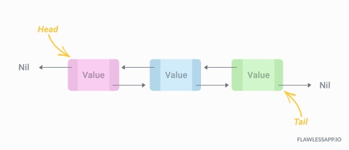
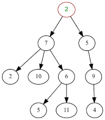

# Data Structures Tutorial
Welcome! Here we'll be going over three types of data structures found and used in python: stacks, linked lists, and trees

In this tutorial, you will find information and tips on these three data structures:
# [Stacks](stacks.md)

# [Linked Lists](linked_lists.md)

# [Trees](trees.md)

