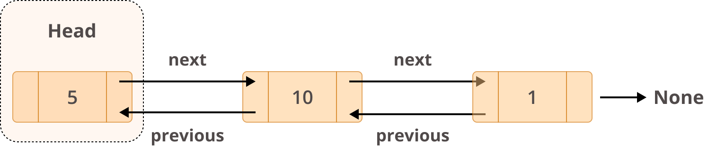

# Linked Lists




# Introduction
Linked lists are another data strucutre, obviously, based on lists. However, instead of keeping each element next to one another in memory, like in a list, elements of a linked list are kept in even random places in memory. But their position in a linked list is still kept track of through what are called pointers. Each element in a linked list has up to three attributes: it's value, it's next, and it's previous. These next and previous attributes are the pointers of the element and are used to refer to the elements that come before or after that element. A linked list will also have a head and a tail, that only have a next, and a previous pointer, respectively. 

One thing to note is that some linked lists only have elements with next pointers and values. Those with both next and previous pointers are called doubly-linked or bi-directional lists. 

# Creating a linked list class

 Here is some sample code that shows how to implement a doubly linked list class. 
```python
class LinkedList:
    #Class to form a new node, or element of a linked list
    class Node:
        def __init__(self,data,next=None,previous=None):
            self.data = data
            self.next = next
            self.previous = previous
    
    def __init__(self):
        self.length = 0
        self.head = None
        self.tail = None

    #Method to insert a node at the beginning of a linked list
    def insert_head(self,data):
        #In case the linked list does not already have a head node
        if self.head is None:
            self.head = LinkedList.Node(data)
            self.tail = self.head

        #In case the linked list does already have a head node
        else:
            old_head = self.head
            self.head = Node(data,next=old_head)
            old_head.previous = self.head

        self.length += 1

    #Method to insert a node at the end of a linked list
    def insert_tail(self,data):
        #In case the linked list does not already have a tail node
        if self.tail is None:
            self.tail = LinkedList.Node(data,previous=self.head)
            self.head.next=self.tail
        #In case the linked list does already have a tail node.
        else:
            new_node = LinkedList.Node(data,previous=self.tail)
            self.tail.next = new_node
            self.tail = new_node

        self.length += 1

    #Method to insert a node at whichever location desired according to the nodes it'll go between.
    def insert_node(self,data,previous,next):
        new_node = LinkedList.Node(data,previous,next)
        previous.next = new_node
        next.previous = new_node

        self.length += 1
    
    #Method to insert a node at a desired index in the linked list
    def insert_node_at_index(self,data,index):
        if index == 0:
            self.insert_head(self,data)

        elif index == self.length:
            self.insert_tail(self,data)
        
        else:
            current_node = self.head
            current_num = 1
            while current_num != index:
                current_node = current_node.next
                current_num += 1

            new_node = LinkedList.Node(data,previous=current_node,next=current_node.previous)
            current_node.next.previous = new_node
            current_node.next = new_node
            self.length += 1

    
    #Method to display a linked list's nodes. 
    def display_list(self):
        curr = self.head
        while curr is not None:
            print(curr.data)
            curr = curr.next

example = LinkedList()
example.insert_head("beginning")
example.insert_tail("ending")

example.insert_node("middle",example.head,example.tail)
example.insert_node_at_index("other middle",2)
example.display_list()
```

# Benefits 
One benefit of a linked list is its efficiency in comparison to a regular list or array when inserting new values. If you're working with a singly linked list, all you need to do is edit the next pointer of the node after which you'd like to insert a new node and point that new node to the next node.

 Even a doubly linked list requires changing one node's previous and one node's next pointers and assign two pointers for the new node to those two nodes mentioned. 

The Big O notation for the efficiency for operations in a linked list are the following:
- Inserting a head or tail (inserting a node at the beginning or end of a linked list): O(1)
- Inserting a node anywhere else in the inked list: O(n)
- Finding the length/size of a linked list: O(n)
- Checking if a linked list is empty: O(1)


In comparison, in order to insert a new value into a list or other regular array, the computer then has to reallocate and shift all elements of the list, making any inserting in a regular list O(n) (See picture below)


# Application
One application of a linked list that can be very useful is the implemntation of a linked list to function as a queue. A queue is another type of data structure that is also similar to a list. The only types of allowed manipulation of a queue are adding to the end, or taking away from the front of the queue. 

See the code below for an example
``` python
# this code implements the previously shown linked list class
class Queue:
    def __init__(self):
        self.queue = LinkedList()

    #Adding an item to the back of the queue
    def enqueue(self,value):
        self.queue.insert_tail(value)

    #Taking an item from the front of the queue
    def dequeue(self,value):
        self.queue.head = self.queue.head.next
        self.queue.insert_head(value)
```

One could also easily use a linked list in creating waypoints to form a path to follow on a map. You would simply need an application to record each waypoint, placing it in a linked list referencing the previous point, meaning each point between the start and end of the path would have a referene to the previous and next points in the path.
This type of implementation would allow the user to select any waypoint and quickly navegate the path, going either forwards or backwards along the created path. 

See below for this implementation:
```python 
class Path:
    
    def __init__(self):
        self.waypoints = []
        self.beginning = None
        self.end = None

    #Adding a new waypoint to the path
    def add_waypoint(self,coordinates):
        print(len(self.waypoints))
        new_waypoint = Waypoint(coordinates=coordinates)
        #In case this is the first waypoint to be added
        if len(self.waypoints) == 0:
            self.beginning = new_waypoint
        #In case this is the second waypoint to be added
        elif len(self.waypoints) == 1:
            new_waypoint.previous = self.beginning
            self.beginning.next = new_waypoint
        else:
            new_waypoint.previous = self.waypoints[-1]
            self.waypoints[-1].next = new_waypoint

        self.waypoints.append(new_waypoint)
        self.end = self.waypoints[-1]
        print(f"Current List: {self.waypoints}")

    def display_path(self):
        if self.end is None:
            self.end = self.waypoints[-1] 

        print(f"We start our path at: {self.beginning.coordinates}")
        current = self.beginning.next
        while current != self.end:
            print(f"Next, we go to {current.coordinates}")
            current = current.next

        print(f"And then we end our path at {self.end.coordinates}")

#Simple class to form a waypoint, or node in the linked list
class Waypoint:
    def __init__(self,coordinates):
        self.previous = None
        self.next = None
        self.coordinates = coordinates

#Creating some coordinates to cycle through and use as waypoint coordinates
coordinates = [[5,5],[5,7],[2,5]]

path = Path()
for coord in coordinates:
    path.add_waypoint(coord)

path.display_path()`
``` 

# Your Turn
Now that you've learned a bit about linked lists, it's time for you to try solving a problem invovling linked lists. In the file below, you'll find a linked list class that has been made to be used as a queue. A queue that has two functions, you can either add to the back of the list, or take the first item off the front of the list. A linked list makes this very efficient, only needing to remove and reassign a head, or add a pointer to the current tail node and add a new node as the new tail. Your job is to implement a search function for this queue to see if a node with a certain value is already in the queue. 

Once you've completed the challenge, or if you run into any problems, check the solution below. Good luck!

[Linked List Problem File](linked_list_problem.py)

[Linked List Solution File](linked_list_solution.py)


## [Back to welcome page](introduction.md)


