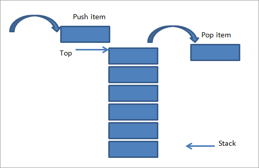

# Stacks

![Image of a stack]([stacks.png]
# Intro and real-life application 
Stacks are a data structure based on a list, but one that behaves differently. Stacks have a "Last-In-First-Out" behavior, also called LIFO

Stacks can be easily found in real life. One good way to imagine a stack and it's behavior is cars pulling into a one-car-wide driveway. Let's say three cars pull into this driveway one after another. For the second car to leave, the third one must first pull out, and the same goes for the first car, meaning the third and second ones must first leave. Other examples include stacks of books or plates in a cupboard. 


# Methods used on stacks
The two main methods used with stacks are push and pop, otherwise known as pull. In python, push is accomplished using the append method, as you will see below. Push simply adds a new item to the top of the stack, while pull simply grabs and removes the last item placed on the stack. Two other methods that can be used with stacks are length, to find the size of the stack, and empty, which is simply used to tell if the stack is empty or not.

Stacks are a very efficient data structure, as each of these methods have an efficiency of O(1). Even finding the length of a stack is also O(1)


# More applications
In computers, stacks are used to keep track of undo/redo functions, or even back/forward functions in a web browser. In general computers use this data structure when running any program and its functions, placing each function on top when it is called, and pulling it from the stack when it finished running. (see image below)


# Stack syntax in code
```python

stack = []

#Pushing items onto stack
stack.append(3)
stack.append(5)
stack.append(9)
print(stack)
#[3,5,9]

#Popping item from top of stack
print(stack.pop())
#9

print(stack)
#[3,5]
```
# Common errors made with stacks
Some common errors that can occur when using stacks mostly involve the size of a stack or amount of items actually left in a stack. Stack underflow is an error that occurs when an attempt is made at popping an item from a stack when there aren't any items left. This error is simple to fix by simply changing code to make sure only the correct amount of items is pulled from a stack. Other errors can also be fixed by looking at the amount of items that you are trying to store or that your program is actually trying to store, and making adjustments. 

# Using stacks
One application that stacks can be used for is checking the amount of opening and closing parentheses in an expression. This is done by working through the expression and adding or popping parentheses from a stack depending on if a parenthese that is come across is opening or closing. 
See the code example below:
``` python
def check_parentheses(string):
    parentheses_stack = [] #Establish stack to work with
    for char in string: 
        if char == ")": 
            if len(parentheses_stack) == 0: #If there aren't any opening parentheses and you come across a closing parenthese
                print("Sorry, there has been an error, too many ('s"))
                return False
            else:
                parentheses_stack.pop() #Remove an opening parenthese from the stack
        if char == "(":
            parentheses_stack.append("(") #Add an opening parenthese from the stack

    if len(parentheses_stack) == 0: #If after going through all the characters of the math expression, and there aren't any opening parentheses left in the stack, then everything's good!
        return True
```
# Your turn
Now that you've learned a bit about stacks, it's time for you to try solving a problem using stacks. 

For this problem, you'll implement a function that reverses a string using a stack. Once you're done, or if you need help, just check out the solution file! Good luck! 

[Stacks Problem File](stack_problem.py)

[Stacks Solution File](stack_solution.py)

## [Back to welcome page](introduction.md)
